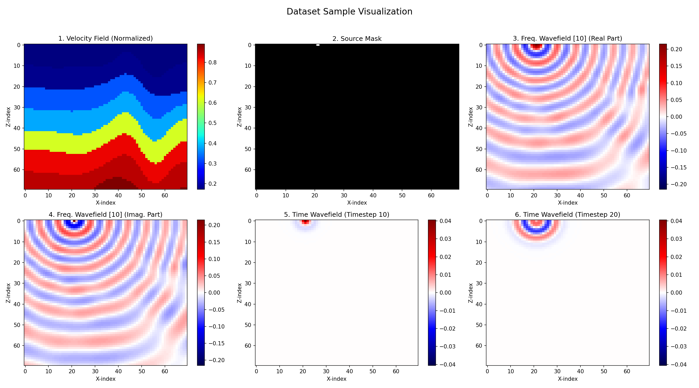

# 基于PyTorch的二维声波方程有限差分模拟器
本项目是使用Python和PyTorch实现的二维非齐次声波方程的有限差分法（FDM）求解器。它利用PyTorch的强大计算能力，可以在支持CUDA的GPU上高效运行，从而大幅加速地震波场模拟。

该代码专门设计用于处理**OpenFWI**数据集中的速度场模型，通过模拟多个炮点（震源）的激发，生成对应的时域和频域波场数据，适用于后续的地震反演等研究任务。


## 主要功能

*   **GPU加速**：基于PyTorch后端，充分利用NVIDIA GPU进行并行计算，显著缩短模拟时间。
*   **高阶有限差分**：采用空间六阶精度的有限差分格式，以提高模拟的准确性。
*   **PML吸收边界**：实现了分裂式完全匹配层（PML）吸收边界条件，有效压制来自模型边界的人为反射。
*   **批处理能力**：可以一次性处理多个速度模型（批处理），实现高通量的数据生成。
*   **与OpenFWI集成**：脚本设计用于直接读取和处理OpenFWI数据集中的速度场文件（`.npy`格式）。
*   **数据自动化处理**：自动完成数据集划分（训练集/测试集）、数据模拟、傅里叶变换以及结果的保存。

## 环境要求

在运行此脚本之前，请确保您已安装torch 和 numpy. 

## 使用方法

使用batchTest.py来运行模拟, 按照以下步骤来配置和运行模拟。

### 1. 准备数据集

脚本需要读取OpenFWI的速度场数据。请将您的数据集按照以下或类似的目录结构存放。代码通过 `v_ROOT_DIR` 变量读取数据，您需要确保路径正确。

假设您的数据集存放在 `/path/to/data` 目录下，结构应如下：

```
/path/to/data
├── CA/
│   └── model/
│       ├── model_0.npy
│       ├── model_1.npy
│       └── ...
├── FFB/
│   └── model/
│       ├── model_0.npy
│       ├── model_1.npy
│       └── ...
└── style-A/
    └── model/
        ├── model_0.npy
        ├── model_1.npy
        └── ...
```
每个 `.npy` 文件包含一批速度模型，其形状通常为 `(数量, 1, 高度, 宽度)`。

### 2. 配置脚本

在运行脚本之前，您需要根据您的环境和需求修改脚本开头部分的 **全局配置** 参数。

关键参数说明：

*   `device`: 脚本会自动检测并使用CUDA设备。如果想强制使用CPU，可以改为 `torch.device("cpu")`。
*   `v_ROOT_DIR`: **(必须修改)** 这是一个列表，包含了您所有输入速度场模型的根目录。请根据您在上一步中存放数据集的位置进行修改。
    ```python
    # 示例
    v_ROOT_DIR = [
        "/path/to/your/CA/model", 
        "/path/to/your/style-A/model", 
        "/path/to/your/FFB/model"
    ]
    ```
*   `v_OUTPUT_DIR`: **(必须修改)** 这是所有模拟结果的输出目录。请确保您对该目录有写入权限。
    ```python
    # 示例
    v_OUTPUT_DIR = "/path/to/your/output_data/"
    ```
*   `BATCH_SIZE`: 批处理大小。根据您的GPU显存大小进行调整。
*   `numFromAClass`: 定义从每个类别（如CA, FFB）中加载的速度场总数。
*   `test_sample_num`: 定义从每个类别中划分多少个速度场作为测试集。
*   其他物理和模拟参数（如 `pml_width`, `dz`, `dx`, `nt`, `dt`, `f0` 等）可以根据您的研究需求进行调整。

### 3. 运行模拟

将代码保存为一个Python文件（例如 `fdm_simulator.py`），然后在终端中运行它：

```bash
python fdm_simulator.py
```

脚本将开始执行，并显示加载数据和处理批次的进度条。

## 输出文件结构

模拟完成后，所有生成的数据将保存在您指定的 `v_OUTPUT_DIR` 目录下，并自动划分为 `train` 和 `test` 子目录。文件结构如下：

```
/path/to/your/output_data/
├── train/
│   ├── data/
│   │   └── velData{id}.npy       # 训练集速度场模型
│   └── freq/
│       └── fftResModel{id}_source{shot}.npy  # 训练集频域波场数据
│
└── test/
    ├── data/
    │   └── velData{id}.npy       # 测试集速度场模型
    ├── freq/
    │   └── fftResModel{id}_source{shot}.npy  # 测试集频域波场数据
    └── sp/
        └── ResModel{id}_source{shot}.npy     # 测试集时域波场快照 (snapshots)
```

*   `{id}` 是每个速度场模型的唯一全局索引。
*   `{shot}` 是炮点（震源）的索引，从0到3。

例如，文件 `fftResModel101_source2.npy` 表示使用ID为101的速度场模型，在第3个炮点（索引为2）位置激发后记录的频域波场数据。